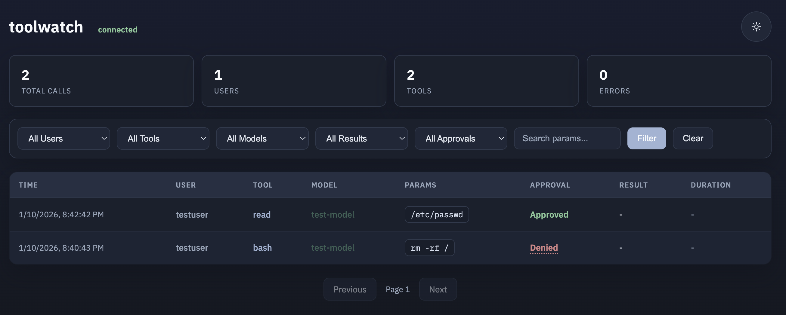

# toolwatch

Tool call auditing and approval system.



- **Audit logging** - All tool calls recorded with user, timestamp, model, and parameters
- **Configurable rules** - JSON-based rules to allow, deny, or require approval
- **Local or remote** - Evaluate rules locally in the extension or remotely via collector
- **Plugin system** - TypeScript plugins for custom approval logic
- **Manual approval** - TUI dialogs (local) or web UI (remote) for reviewing tool calls
- **Sync/async modes** - Block on approval or fire-and-forget logging

## Components

| Component | Description |
|-----------|-------------|
| [common/](common/) | Shared types and rules engine |
| [extension/](extension/) | Pi extension that captures tool calls |
| [collector/](collector/) | HTTP server with SQLite storage and web UI |

## Quick Start

### Install Extension

Build and deploy the bundled extension (no npm install required at destination):

```bash
# Build
cd ~/pi-extensions/toolwatch/extension
npm install
npm run dist

# Deploy (just 2 files: index.js + config.json)
cp -r dist/* ~/.pi/agent/extensions/toolwatch/
```

Or for development (requires npm install):

```bash
ln -s ~/pi-extensions/toolwatch/extension ~/.pi/agent/extensions/toolwatch
cd ~/.pi/agent/extensions/toolwatch && npm install
```

### Local Rules (No Collector)

For simple use cases where you just need local policy enforcement:

Edit `~/.pi/agent/extensions/toolwatch/config.json`:

```json
{
  "rules": {
    "mode": "local",
    "rules": [
      { "match": { "tool": "bash", "params.command": "/sudo/" }, "action": "deny", "reason": "No sudo" },
      { "action": "allow" }
    ]
  },
  "audit": { "mode": "none" },
  "tools": []
}
```

### Remote Rules (With Collector)

For full audit logging and web UI:

```bash
# Start collector
cd ~/pi-extensions/toolwatch/collector
npm install
npm run dev
```

Edit `~/.pi/agent/extensions/toolwatch/config.json`:

```json
{
  "rules": { "mode": "remote", "timeoutMs": 30000, "errorAction": "block" },
  "audit": { "mode": "http", "http": { "url": "http://localhost:9999/events" } },
  "tools": ["bash", "read"]
}
```

Edit `collector/config.json` for rules (see [Collector Configuration](#collector-configuration)).

---

## Extension Configuration

### Config Structure

```typescript
{
  rules: {
    mode: "local" | "remote" | "none";
    // Local mode only
    rules?: Rule[];
    plugins?: Record<string, string>;
    // Remote mode only (requires audit.http.url)
    timeoutMs?: number;        // 0 or undefined = no timeout
    errorAction?: "block" | "allow";   // Action on timeout or HTTP error
  };
  audit: {
    mode: "none" | "file" | "http" | "both" | "http-with-fallback";
    http?: { url: string };
    file?: { path: string };
  };
  tools: string[];  // Empty = all tools
}
```

### Rules Mode

| Mode | Description |
|------|-------------|
| `local` | Evaluate rules locally in the extension |
| `remote` | Send events to collector for rules evaluation (requires `audit.http.url`) |
| `none` | No rules evaluation (audit only or passthrough) |

### Audit Mode

| Mode | Description |
|------|-------------|
| `none` | No audit logging |
| `file` | Write events to local JSONL file |
| `http` | Send events to collector via HTTP |
| `both` | Write to file AND send via HTTP |
| `http-with-fallback` | Send via HTTP, write to file on failure |

**Audit-only HTTP events**: When the extension is only logging (local rules or `rules.mode: "none"`), it marks HTTP audit requests with `X-Toolwatch-Audit: true` so the collector stores the event without evaluating rules and returns `{ "approved": true }`.

### Example Configurations

**Local rules, no audit (simple gate):**
```json
{
  "rules": {
    "mode": "local",
    "rules": [
      { "match": { "tool": "bash", "params.command": "/rm -rf/" }, "action": "deny" },
      { "action": "allow" }
    ]
  },
  "audit": { "mode": "none" },
  "tools": []
}
```

**Local rules with TUI manual approval:**
```json
{
  "rules": {
    "mode": "local",
    "rules": [
      { "match": { "params.path": "/\\.env/" }, "action": "manual" },
      { "action": "allow" }
    ]
  },
  "audit": { "mode": "file", "file": { "path": "/tmp/toolwatch.jsonl" } },
  "tools": []
}
```

**Remote rules, wait forever (manual approval via web UI):**
```json
{
  "rules": { "mode": "remote" },
  "audit": { "mode": "http", "http": { "url": "http://localhost:9999/events" } },
  "tools": ["bash", "read"]
}
```

**Remote rules with 30s timeout:**
```json
{
  "rules": { "mode": "remote", "timeoutMs": 30000, "errorAction": "block" },
  "audit": { "mode": "http", "http": { "url": "http://localhost:9999/events" } },
  "tools": ["bash", "read"]
}
```

**Audit only (no rules):**
```json
{
  "rules": { "mode": "none" },
  "audit": { "mode": "http", "http": { "url": "http://localhost:9999/events" } },
  "tools": []
}
```

The collector records audit-only tool calls as approved without applying rules.

---

## Collector Configuration

### Rules

Rules are evaluated top-to-bottom, first match wins.

Edit `collector/config.json`:

```json
{
  "rules": [
    { 
      "match": { "tool": "bash", "params.command": ["/rm\\s+-rf/", "/sudo/"] }, 
      "action": "deny",
      "reason": "Dangerous command blocked"
    },
    { 
      "match": { "params.path": "/\\.env/" }, 
      "action": "plugin", 
      "plugin": "manual" 
    },
    { "action": "allow" }
  ],
  "plugins": {
    "manual": "./plugins/manual.ts"
  }
}
```

### Match Syntax

- **Exact match**: `"tool": "bash"`
- **Regex**: `"params.command": "/rm.*-rf/"` (wrapped in `/`)
- **OR (array)**: `"tool": ["bash", "read"]`
- **AND (multiple fields)**: `{ "tool": "bash", "user": "admin" }`

### Matchable Fields

`tool`, `user`, `hostname`, `cwd`, `model`, `params.command`, `params.path`, etc.

### Actions

| Action | Description |
|--------|-------------|
| `allow` | Approve immediately |
| `deny` | Deny with optional `reason` |
| `manual` | Require manual approval (TUI or Web UI) |
| `plugin` | Invoke custom plugin by name |

---

## Plugins

### Manual Approval

Use `"action": "manual"` for interactive approval:

- **Local mode (extension)**: Shows TUI confirmation dialog
- **Remote mode (collector)**: Shows Web UI approval, blocks until approved/denied

### Custom Plugins

```typescript
// collector/plugins/my-plugin.ts
import type { ToolCallEvent, ApprovalPlugin } from "../src/types.js";

const plugin: ApprovalPlugin = {
  async evaluate(event: ToolCallEvent) {
    return { 
      approved: true,  // or false
      reason: "..."    // shown to agent if denied
    };
  },
};

export default plugin;
```

Register in `collector/config.json`:

```json
{
  "plugins": { "my-plugin": "./plugins/my-plugin.ts" }
}
```

---

## Web UI

Available when using remote mode with collector. Single page at `/` with:

- Tool call history with filters, paginated (50 per page)
- Real-time pending approval notifications via WebSocket
- Navigation between multiple pending approvals (< 1 of N >)
- Connection status indicator (connected/disconnected)

---

## API

| Endpoint | Method | Description |
|----------|--------|-------------|
| `/events` | POST | Receive tool call/result events |
| `/api/calls` | GET | Query tool calls |
| `/api/stats` | GET | Statistics |
| `/api/pending` | GET | Pending approvals |
| `/approve/:id` | POST | Approve pending |
| `/deny/:id` | POST | Deny pending |

---

## Database Tool

CLI for exporting and deleting records:

```bash
cd collector

# Export to JSON
node scripts/db-tool.mjs ./toolwatch.db export --output backup.json
node scripts/db-tool.mjs ./toolwatch.db export --user alice --tool bash
node scripts/db-tool.mjs ./toolwatch.db export --before 2026-01-01 --limit 100

# Delete records (requires at least one filter)
node scripts/db-tool.mjs ./toolwatch.db delete --approval pending --dry-run
node scripts/db-tool.mjs ./toolwatch.db delete --before 2026-01-01
```

Options: `--user`, `--tool`, `--model`, `--approval`, `--error`, `--success`, `--before`, `--after`, `--search`, `--limit`, `--output`, `--dry-run`

---

## Drain Utility

Resend events from local file to collector:

```bash
cd extension
npx tsx drain.ts
```

Requires both `audit.file.path` and `audit.http.url` configured.

---

## Legacy Config Support

The extension supports the previous config format for backward compatibility:

```json
{
  "mode": "http-with-fallback",
  "http": { "url": "...", "sync": true, "timeoutMs": 30000, "errorAction": "block" },
  "file": { "path": "/tmp/toolwatch.jsonl" },
  "tools": ["bash"]
}
```

This is automatically converted to the new format on load.

---

## Testing

```bash
cd collector && npm test
cd common && npm test
```

---

## Files

```
toolwatch/
├── common/                  # Shared module (bundled into extension)
│   ├── src/
│   │   ├── types.ts        # Shared types
│   │   ├── rules.ts        # Rules evaluation engine
│   │   └── plugin-loader.ts
│   └── test/
├── extension/
│   ├── index.ts            # Main extension entry
│   ├── config.json         # Default config
│   ├── src/
│   │   ├── config.ts       # Config loading
│   │   ├── evaluator.ts    # Local/remote evaluation
│   │   ├── audit.ts        # Audit logging
│   │   └── utils.ts
│   ├── plugins/
│   │   └── manual.ts       # TUI manual approval
│   ├── common/             # Symlink or copy of ../common
│   ├── dist/               # Built output (npm run dist)
│   │   ├── index.js        # Bundled extension (~13KB)
│   │   └── config.json     # Config copy
│   └── drain.ts
├── collector/
│   ├── config.json
│   ├── src/
│   │   ├── index.ts
│   │   ├── server.ts
│   │   ├── db.ts
│   │   ├── rules.ts
│   │   └── ui.ts
│   ├── plugins/
│   │   └── manual.ts       # Web UI manual approval
│   └── test/
└── docs/
    └── design/
        └── local-rules.md  # Design document
```

---

## Known Limitations

**Sync mode blocking**: When using remote rules or local plugins, the extension blocks waiting for approval. During this time, the user cannot cancel with Escape in pi. Workarounds:
- Use shorter `timeoutMs` values (remote mode)
- Set `errorAction: "allow"` to proceed on error (remote mode)
- Use `rules.mode: "none"` for audit-only mode

---

## Todo

- [ ] Cursor-based pagination for high-write scenarios
- [ ] Rule inheritance (include rules from external files)
